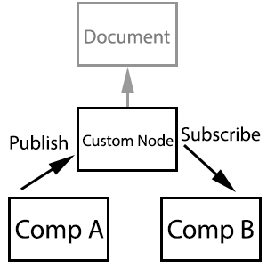

[](https://travis-ci.org/axa-ch/patterns-library)

# The AXA CH Style and HTML Guide (Editor's Draft)
This is the core pattern library used for AXA Switzerland. It's based on Web-Components.
Web-Components are natively supported in modern browser. This repo contains also polyfills for those
less "cool" browsers out there. Support is:

* ie 11 (Polyfill for template, html import, shadow dom and custom element)
* EDGE (Polyfill for html import, shadow dom and custom element)
* FF (Polyfill for html import, shadow dom and custom element)
* Chrome / Chrome Mobile (100% native)
* Safari / iOS Safari (Polyfill for html import)

REF: https://github.com/webcomponents/webcomponentsjs

The main goal here to have components that are reusable with every frontend technology. It doesn't matter if you are using angular or React, you can always import the Components from the pattern library.

*At the moment, we only use Proposed Standard Custom Element, therefore it will run natively on Safari and Chrome on mobile and desktop.*

__Are you not familiar with Webcomponents__?
Then stop here and read this (chapter Introduction and Specification): https://www.webcomponents.org/introduction

To know how they work in your browser go to the w3c Spec. Here the link to the custom element for example: https://www.w3.org/TR/custom-elements/

Hold on, don't re-invent the wheel! Check if that what you have to do already exists: https://www.webcomponents.org/  

## Setting things up with your Repo:

Well first of all install the npm module:

`npm install --save @axa-ch/patterns-library` or while still in development better `npm install https://github.com/axa-ch/patterns-library.git --save`

Then, you can add the component of your choice simply by importing the `index.js` which is contained in the  `/dist/components/**` folder! Styles, HTML and JS will be all in one file!

**As an example:**

Import the button via `import '@axa-ch/patterns-library/dist/components/m-button'` in your `index.js` to be able to use the button. Wherever you want, add `<axa-button>Hello</axa-button>` in your html and like magic, the button will work!

If a component has dependecies to other components, you will have to add them as well. The button in the example above actually has a dependency to `a-icon`. So we will have to include it as well. **Remember, a molecule or an organism will always have dependecies to other components.** These components will work also by adding them directly with the `<script src='@axa-ch/patterns-library/dist/components/m-button'></script>` tag.

To use the webcomponents with older browsers, import the polyfills which are available under
`<script src="node_modules/@axa-ch/patterns-library/dist/app/webcomponents-lite.js"></script>`

A quick overview what they do:
`webcomponents-lite.js` includes all the polyfills needed for ES6 ready browsers and includes polyfills for all 4 parts of the webcomponents specs.
`es6-polyfills.js` are all the polyfills needed for ie11.
Alternativly to `webcomponents-lite.js`, `webcomponents-loader.js` loads the polyfills that is needed asynchronously via AJAX.

If you are using your own framework, be aware to convert the webcponents to a component for your framework (simple components like `m-button` does not need to be converted):

Do you love **angular >= 2**? Here a helpfull link for you: https://www.sitepen.com/blog/2017/09/14/using-web-components-with-angular/

Do you love **React**? Here a helpfull link for you: https://github.com/webcomponents/react-integration

Do you love **Vue**? Here a helpfull link for you: https://alligator.io/vuejs/vue-integrate-web-components/

## Adding your first Pattern Library component:
Super easy: Read the specs and then just execute `npm run new`. Follow the instruction on the CLI.

## Main NPM commands:

* To build to dist folder, simply run `npm run build`
* to run server and watchers (this is what you want while you are developing) `npm run serve`
* to run the PROD server `npm run serve-build-prod`

## How do we release a new version

We have a strict strategy for releasing new versions of the Patterns Library. Please refer to the wiki: https://github.com/axa-ch/patterns-library/wiki/Crafting-a-release

## Developers Guide:

### Publish / Subscribe between webcomponents

To listen to events and triggers between components, we use some decoupled events. This logic is included in the `BaseComponent` class and is available for every component.

The publish/subscribe system use native Custom Events (https://dom.spec.whatwg.org/#interface-customevent). Per default they don't bubble and don't cancel (no prevent default). The event name is name spaced with a slash.

Here is the declaration of the publish function:

```javascript
/**
 * Publish a message regarding a given topic.
 *
 * @param {String} topic - A string defining the topic to publish to.
 * @param {*} arg - The data associate with the generated event.
 * @param {Element} [node=document] - The node to publish message to.
 */
export function publish(topic, arg, node = document) {
  ...
}
```

The event, per default, are propagated through the document node:


Example:
```javascript
// COMP A triggers
publish('device-state/change', state);

// COMP B listens
subscribe('device-state/change', (state) => {
  ...
});

// As all the events are asynchronously, if COMP A want to know if someone specifically subscribe
// to the publish we have a system event for it. Lets say N components will or have subscribed to COMP A, but COMP A
// wants to know only when COMP B subscribed, he can listen to the Subscription event of COMP B:
subscribe('pubsub/onsubscribe/device-state/change', () => {});

```

Alternatively, you can set a custom node where the event will be triggered on:



The concept is similar to the description above, with the difference that you can pass a context.

```javascript
// context node here is used to encapsulate event listeners and triggers to a single container.
// In the concrete example, we want that not every mobile navigation listen to a publish event, but
// only that one which is inside a certain context. Here could be that axa-header is the containing
// context and axa navigation mobile have to listen to axa main navigation. In order to be sure that
// it listens only to one axa-header and not all potential other ones, we use the context
publish('main-navigation-mobile/close', null, this._contextNode);
subscribe('main-navigation-mobile/close', (arg) => {}, this._contextNode);
```

### Context enabler and context listener

TODO.

### Guide to for the base components:

TODO.
